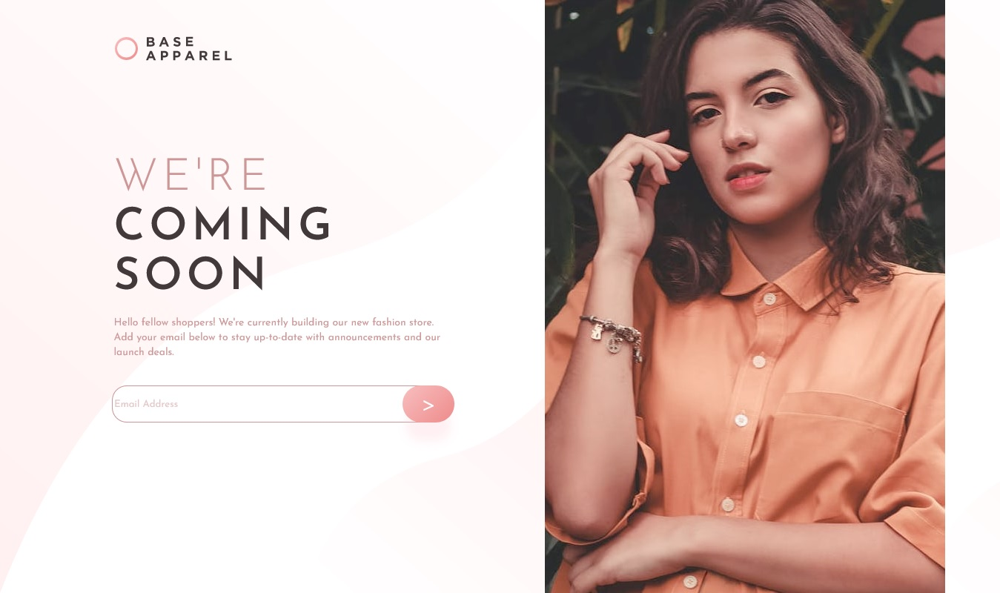

# Frontend Mentor - Base Apparel coming soon page solution

This is my solution to the [Base Apparel coming soon page challenge on Frontend Mentor](https://www.frontendmentor.io/challenges/base-apparel-coming-soon-page-5d46b47f8db8a7063f9331a0). Frontend Mentor challenges help you improve your coding skills by building realistic projects. 

## Table of contents

- [Overview](#overview)
  - [The challenge](#the-challenge)
  - [Screenshot](#screenshot)
  - [Links](#links)
- [My process](#my-process)
  - [Built with](#built-with)
  - [What I learned](#what-i-learned)
  - [Continued development](#continued-development)
  - [Useful resources](#useful-resources)
- [Author](#author)

## Overview

### The challenge

Users should be able to:

- View the optimal layout for the site depending on their device's screen size
- See hover states for all interactive elements on the page
- Receive an error message when the `form` is submitted if:
  - The `input` field is empty
  - The email address is not formatted correctly

### Screenshot

Here is an screenshot of my solution. I think this site is close enough to the original design.

### Links

- Solution URL: [Github](https://github.com/tchock42/Base-Apparel-Coming-Soon-Master)
- Live Site URL: [Netlify](https://heartfelt-bonbon-e65c19.netlify.app/m)

## My process

### Built with

- Semantic HTML5 markup
- CSS custom properties
- Flexbox
- CSS Grid
- Mobile-first workflow

### What I learned

I can list some things that this project help me to improve:
 - CSS grid
 - Flexbox
 - Pseudo classes
 - DOM editing with javascript

### Continued development

Thi project was difficult to me, and there were some features that I cannot do: make some css to the input text and to insert an icon inside a button. I hope in the following projects I'll do it better.

### Useful resources

- [Mozilla docs](https://developer.mozilla.org/es/docs/Web/CSS/:focus) - This helped me for editing input interface when selected or focused
- [CSSMatic](https://www.cssmatic.com/box-shadow) - Makking box-shadows

## Author

- Website - [tchock42](https://github.com/tchock42m)
- Frontend Mentor - [@tchock42](https://www.frontendmentor.io/profile/tchock42)

